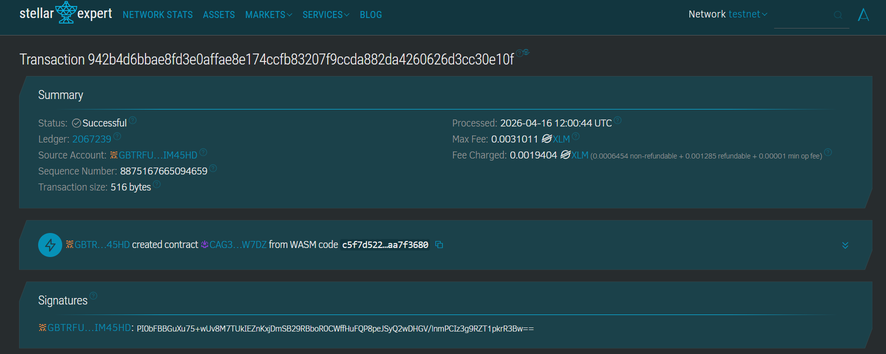

# 🛒 Store Product DApp

**Blockchain-Based Decentralized Product Management System**

---

## 📌 Project Description

**Store Product DApp** is a decentralized smart contract built on the Stellar blockchain using the Soroban SDK. It provides a secure and immutable solution for managing store products directly on-chain.

This application eliminates the need for centralized databases by storing product data within the blockchain. Each product is uniquely identified and managed exclusively through smart contract functions, ensuring transparency, security, and data integrity.

Users can easily create, retrieve, and delete products while benefiting from Stellar’s fast and low-cost transactions.

---

## 🎯 Project Vision

Our vision is to modernize digital commerce infrastructure by:

- 🔐 **Decentralizing Data** — Removing dependency on centralized inventory systems  
- 👤 **Ensuring Ownership** — Giving full control of product data to store owners  
- 🧱 **Guaranteeing Immutability** — Preventing unauthorized modifications  
- 🔎 **Enhancing Transparency** — Making all operations verifiable on-chain  
- 🤝 **Trustless System** — Ensuring integrity through smart contracts  

We aim to build a future where business data is secure, transparent, and fully owned by users.

---

## 🚀 Key Features

### 1. Product Creation
- Add new products with a single function call  
- Define product name and price  
- Automatically generated unique ID  
- Stored permanently on blockchain  

### 2. Product Retrieval
- Fetch all products in one call  
- Structured output for easy frontend integration  
- Real-time blockchain synchronization  

### 3. Product Deletion
- Remove products using unique ID  
- Permanent deletion from storage  
- Efficient data management  

### 4. Security & Transparency
- All actions recorded on-chain  
- Tamper-proof data storage  
- Protected against unauthorized access  

### 5. Stellar Integration
- Fast and low transaction fees  
- Built with Soroban Smart Contract SDK  
- Scalable and efficient  

---

## 📄 Contract Details

- **Contract Address**:  
  `CAG36FNTRY2VSA7LFLX5SETF4O45MT3UM5O6G3OPRRECR35WSRLTW7DZ`



---

## 🔮 Future Scope

### Short-Term
- Stock management system  
- Product categories & tags  
- Numeric price handling (`u64`)  
- Search functionality  

### Medium-Term
- Multi-user role management  
- Product history tracking  
- Asset/image attachment  
- Integration with payment contracts  

### Long-Term
- Full decentralized e-commerce platform  
- Cross-chain support  
- IPFS-based frontend hosting  
- AI-based product recommendations  
- DAO governance system  
- Decentralized identity (DID) integration  

### Enterprise Features
- Inventory management system  
- Audit logs for compliance  
- Automated reporting  
- Multi-language support  

---

## 🛠️ Tech Stack

- **Rust**
- **Soroban SDK**
- **Stellar Blockchain**

---

## ⚙️ Getting Started

1. Deploy the smart contract to the Stellar Soroban network  
2. Interact using the available functions:

```rust
create_product(name, price)
get_products()
delete_product(id)